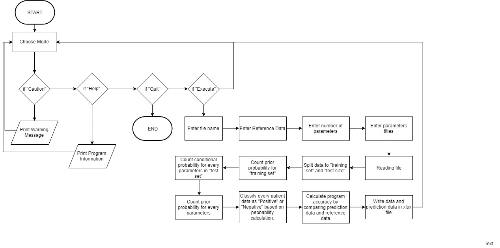

# Disease_Analyzer
This program gives information about patients condition towards certain diseases based on their health conditions (such as, blood pressure, BMI, Ca levels, etc.) using Naive Bayes Algorithm. 

